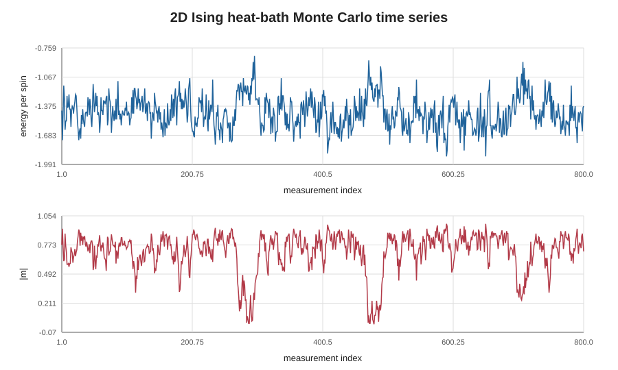
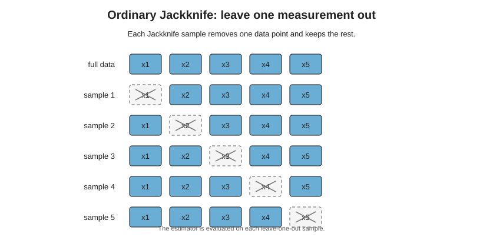
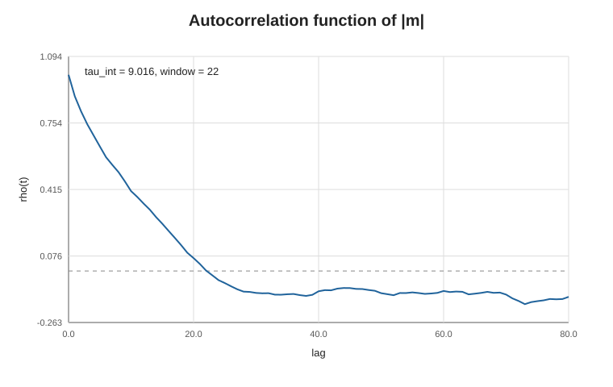
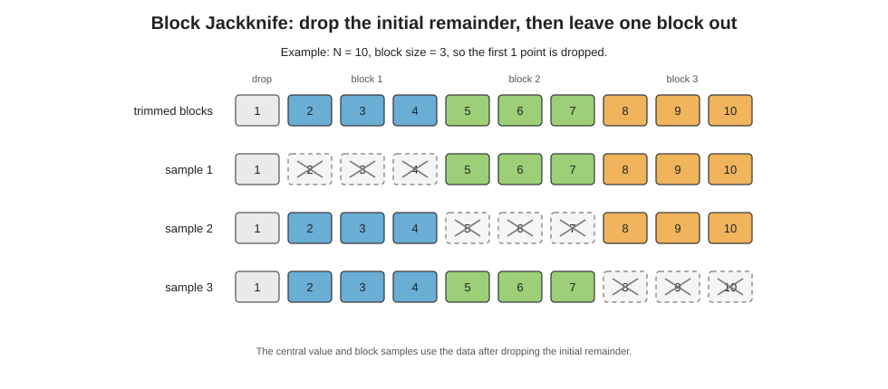
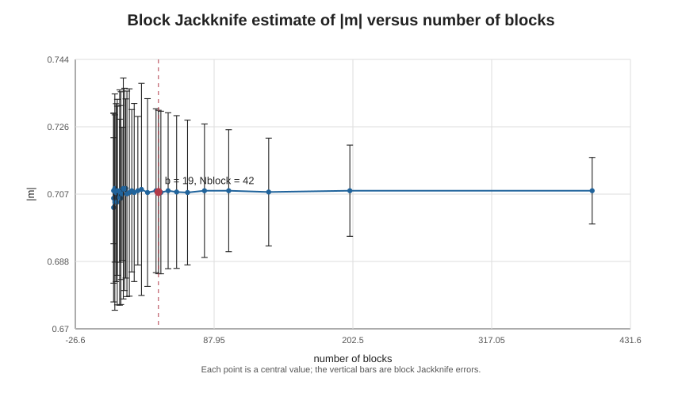
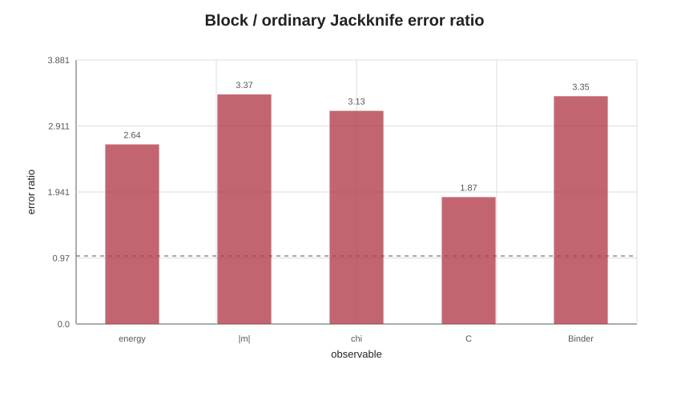
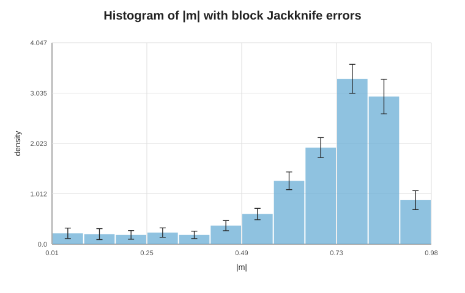

# 2D Ising Model and Jackknife Analysis

このノートでは、2 次元 Ising 模型を題材に、Monte Carlo 測定値の統計誤差、
自己相関、誤差の伝播、Jackknife 法、Block Jackknife 法、histogram の誤差棒を
順に扱う。

実行例は次の script に入っている。

```bash
julia --project=. tutorials/ising2d_jackknife.jl
```

## 1. イジング模型

2 次元正方格子上の各 site \(i\) に spin

$$
s_i = \pm 1
$$

を置く。最近接相互作用のみを考え、周期境界条件を課す。結合定数を
\(J=1\)、Boltzmann constant を \(k_B=1\) とする。Hamiltonian は

$$
E[s] = - \sum_{\langle i,j\rangle} s_i s_j
$$

である。ここで \(\langle i,j\rangle\) は最近接 pair を表し、各 bond は一度だけ
数える。

\(L \times L\) 格子では spin 数は

$$
N_\mathrm{spin} = L^2
$$

である。energy density と magnetization density を

$$
e = \frac{E}{N_\mathrm{spin}},
\qquad
m = \frac{1}{N_\mathrm{spin}}\sum_i s_i
$$

と定義する。

### 厳密解と相転移点

2 次元正方格子 Ising 模型は、外場 \(h=0\) の場合に熱力学極限で厳密に解ける。
Onsager の厳密解により、free energy は解析的に求まり、2 次相転移が存在する
ことが分かる。ここで

$$
K = \beta J
$$

と書くと、等方的な正方格子 Ising 模型の臨界点は

$$
\sinh(2K_c)=1
$$

で与えられる。この tutorial では \(J=1\) なので

$$
\beta_c
= \frac{1}{2}\log(1+\sqrt{2})
\simeq 0.4406867935,
$$

$$
T_c
= \frac{2}{\log(1+\sqrt{2})}
\simeq 2.269185314.
$$

\(\beta < \beta_c\) は高温相で、熱力学極限では自発磁化は 0 である。
\(\beta > \beta_c\) は低温相で、Z\(_2\) 対称性が自発的に破れ、自発磁化が
現れる。Yang の結果による自発磁化は

$$
m_0(\beta)
=
\left[
1 - \sinh^{-4}(2\beta)
\right]^{1/8}
\qquad (\beta > \beta_c)
$$

である。一方、有限体積で外場がない場合は、spin flip 対称性のため
\(\langle m\rangle=0\) になる。そのため数値計算では、秩序変数の大きさを見る
量として \(\langle |m| \rangle\) や \(\langle m^2\rangle\) をよく使う。

この tutorial の default 値 \(\beta=0.44\) は \(\beta_c\) に近い。したがって
揺らぎが大きくなりやすく、自己相関や block Jackknife の効果を見る例として
都合がよい。

この tutorial の code では、energy per spin を次のように測る。

```julia
function energy_per_spin(spins)
    L = size(spins, 1)
    energy = 0
    for i in 1:L
        ip = i == L ? 1 : i + 1
        for j in 1:L
            jp = j == L ? 1 : j + 1
            energy -= spins[i, j] * (spins[ip, j] + spins[i, jp])
        end
    end
    return energy / length(spins)
end
```

右方向と上方向の bond だけを足すので、各最近接 bond を一度だけ数える。

magnetization per spin は

```julia
function magnetization_per_spin(spins)
    return sum(spins) / length(spins)
end
```

である。

## 2. 熱浴法

Monte Carlo では、Boltzmann 分布

$$
P[s] = \frac{1}{Z} e^{-\beta E[s]}
$$

に従う configuration を生成したい。ただし

$$
\beta = \frac{1}{T},
\qquad
Z = \sum_s e^{-\beta E[s]}
$$

である。

熱浴法では、周囲の spin を固定したまま、site \(i\) の spin \(s_i\) を
条件付き確率から直接引き直す。近傍 spin の和を

$$
h_i = \sum_{j\in\mathrm{nn}(i)} s_j
$$

とする。このとき、site \(i\) に関係する energy は

$$
E_i = -s_i h_i
$$

である。したがって

$$
P(s_i=+1 \mid \{s_j\}_{j\ne i})
=
\frac{e^{\beta h_i}}{e^{\beta h_i}+e^{-\beta h_i}}
=
\frac{1}{1+e^{-2\beta h_i}},
$$

$$
P(s_i=-1 \mid \{s_j\}_{j\ne i})
=
\frac{e^{-\beta h_i}}{e^{\beta h_i}+e^{-\beta h_i}}
=
\frac{1}{1+e^{2\beta h_i}}.
$$

code では

```julia
neighbor_sum = spins[ip, j] + spins[im, j] + spins[i, jp] + spins[i, jm]
probability_plus = 1 / (1 + exp(-2 * beta * neighbor_sum))
spins[i, j] = rand_float!(rng) < probability_plus ? Int8(1) : Int8(-1)
```

としている。Metropolis 法のような「提案して受理・棄却する」手順ではなく、
局所的な条件付き分布から新しい spin を直接選ぶ。

1 sweep は、平均して全 site を 1 回ずつ更新する程度の長さとして、
\(N_\mathrm{spin}\) 回の single-site update で定義する。

## 3. 熱化と測定

初期 configuration は平衡分布から出ていない。したがって、最初の数 sweep は
熱化のために捨てる。

```julia
measurements = run_ising2d(;
    L=16,
    beta=0.44,
    therm_sweeps=500,
    sweeps=4000,
    measure_every=5,
    seed=20260515,
)
```

この設定では、まず 500 sweep を捨てる。その後 4000 sweep を進め、
5 sweep ごとに測定するので、測定数は

$$
N_\mathrm{meas} = \frac{4000}{5} = 800
$$

である。

戻り値には、測定列が入っている。

```julia
measurements.energies
measurements.magnetizations
measurements.abs_magnetizations
```

ここで `energies` は \(e_k\)、`magnetizations` は \(m_k\)、
`abs_magnetizations` は \(|m_k|\) の列である。

この tutorial 全体の出力は次で確認できる。

```bash
julia --project=. tutorials/ising2d_jackknife.jl
```

実行結果と図は次で再生成できる。

```bash
julia --project=. tutorials/make_tutorial_artifacts.jl
```

出力の全文は [results/ising2d_output.txt](results/ising2d_output.txt) に
保存している。最初の部分には、simulation parameter と測定数が出る。

```text
2D Ising Jackknife tutorial
L = 16, beta = 0.44
update = heat bath
measurements = 800, measure_every = 5
```

この段階で見るべき実行結果は、測定列そのものである。

**図 1. Energy density と absolute magnetization density の時系列**



上の図は、熱化後に測定した energy density \(e\) と absolute magnetization
density \(|m|\) の時系列である。測定列が揺らぎ続けているため、単一の
configuration ではなく ensemble average とその誤差を評価する必要がある。

## 4. 統計誤差

独立な測定値

$$
x_1,x_2,\dots,x_N
$$

から平均

$$
\bar{x} = \frac{1}{N}\sum_{i=1}^N x_i
$$

を推定する。母分散を標本分散

$$
s^2 =
\frac{1}{N-1}
\sum_{i=1}^N (x_i-\bar{x})^2
$$

で推定すると、平均値の標準誤差は

$$
\mathrm{SE}(\bar{x}) = \sqrt{\frac{s^2}{N}}
$$

である。

Monte Carlo 測定では、測定値が Markov chain に沿って生成されるため、一般には
独立ではない。自己相関がある場合、有効な独立 sample 数は \(N\) より小さくなる。
このとき平均値の分散は、おおまかに

$$
\mathrm{Var}(\bar{x})
\simeq
\frac{2\tau_\mathrm{int}}{N} C(0)
$$

と書ける。ここで \(C(0)\) は分散、\(\tau_\mathrm{int}\) は integrated
autocorrelation time である。

## 5. Primary observable

各 configuration で直接測る量を primary observable と呼ぶ。この tutorial では

$$
e_k = \frac{E_k}{N_\mathrm{spin}},
\qquad
|m_k|
$$

を primary observable とする。

JkTools では、平均値と Jackknife error を

```julia
energy = jk_meanerror(energies)
abs_magnetization = jk_meanerror(abs_magnetizations)
```

で計算できる。戻り値は

```julia
(central_value, error)
```

である。

この code に対する実行結果は次である。

```text
Ordinary Jackknife: primary observables
energy per spin                  -1.4415625 +/- 0.00599147
abs magnetization per spin       0.70786133 +/- 0.00672452
```

energy per spin は負で、近接 spin がそろう configuration が多いことを表す。
\(|m|\) は有限体積で見た秩序変数の大きさである。ここでの error は
ordinary Jackknife によるもので、自己相関を block として明示的には扱っていない。

## 6. Secondary observable

測定列全体から作る非線形な量を secondary observable と呼ぶ。
典型例は susceptibility、specific heat、Binder ratio である。

### Susceptibility

magnetization density \(m\) を使い、

$$
\chi =
N_\mathrm{spin}\beta
\left(
\langle m^2\rangle - \langle m\rangle^2
\right)
$$

と定義する。code では

```julia
susceptibility = x -> Nspin * beta * var(x, corrected=false)
sus_val, sus_err = jk_meanerror(magnetizations, susceptibility)
```

と書く。

### Specific heat

energy density \(e\) を使い、

$$
C =
N_\mathrm{spin}\beta^2
\left(
\langle e^2\rangle - \langle e\rangle^2
\right)
$$

と定義する。

```julia
specific_heat = x -> Nspin * beta^2 * var(x, corrected=false)
cv_val, cv_err = jk_meanerror(energies, specific_heat)
```

### Binder ratio

JkTools の `"binder"` / `"bin"` は

$$
B =
\frac{\langle m^4\rangle}{\langle m^2\rangle^2}
$$

を返す。

```julia
binder_val, binder_err = jk_meanerror(magnetizations, "binder")
```

別の convention として Binder cumulant

$$
U =
1 -
\frac{\langle m^4\rangle}{3\langle m^2\rangle^2}
= 1 - \frac{B}{3}
$$

を使うことも多い。その場合は関数として渡す。

```julia
binder_cumulant = x -> 1 - mean(x .^ 4) / (3 * mean(x .^ 2)^2)
u_val, u_err = jk_meanerror(magnetizations, binder_cumulant)
```

この tutorial の実行結果では、secondary observable は次のようになる。

```text
Ordinary Jackknife: secondary observables
susceptibility                   4.76521108 +/- 0.439192
specific heat                    1.42153704 +/- 0.0716418
Binder ratio                     1.16003095 +/- 0.01108673
```

susceptibility と specific heat は分散から作る量なので、平均だけでなく
fluctuation の大きさを測っている。Binder ratio は分布の形、特に
\(m^2\) と \(m^4\) の関係を見る量であり、有限サイズスケーリングでもよく使う。

## 7. 誤差の伝播

複数の推定量

$$
a_1,a_2,\dots,a_p
$$

から

$$
y = f(a_1,\dots,a_p)
$$

を作るとする。共分散行列を

$$
\Sigma_{ij}
=
\mathrm{Cov}(a_i,a_j)
$$

とすると、線形近似による誤差伝播は

$$
\sigma_y^2
\simeq
\sum_{i,j}
\frac{\partial f}{\partial a_i}
\Sigma_{ij}
\frac{\partial f}{\partial a_j}
$$

である。

独立な 2 変数 \(a,b\) の関数 \(y=f(a,b)\) なら

$$
\sigma_y^2
\simeq
\left(\frac{\partial f}{\partial a}\right)^2\sigma_a^2
+
\left(\frac{\partial f}{\partial b}\right)^2\sigma_b^2
$$

となる。相関がある場合は交差項

$$
2
\frac{\partial f}{\partial a}
\frac{\partial f}{\partial b}
\mathrm{Cov}(a,b)
$$

も必要である。

secondary observable では、この共分散を手で扱うのが面倒になる。例えば

$$
\chi =
N_\mathrm{spin}\beta
\left(
\langle m^2\rangle - \langle m\rangle^2
\right)
$$

では、\(\langle m\rangle\) と \(\langle m^2\rangle\) の相関を含めて誤差を
伝播させる必要がある。Jackknife 法は、この誤差伝播を resampling によって
まとめて扱う方法である。

## 8. Jackknife 法

測定列

$$
x = (x_1,\dots,x_N)
$$

から estimator

$$
\theta = f(x)
$$

を作る。leave-one-out Jackknife では、1 点ずつ抜いた sample

$$
x^{(i)}
=
(x_1,\dots,x_{i-1},x_{i+1},\dots,x_N)
$$

を作り、

$$
\theta_i = f(x^{(i)})
$$

を計算する。Jackknife sample の平均を

$$
\bar{\theta}_\mathrm{JK}
=
\frac{1}{N}\sum_{i=1}^N \theta_i
$$

とすると、Jackknife error は

$$
\sigma_\theta
=
\sqrt{
\frac{N-1}{N}
\sum_{i=1}^N
\left(
\theta_i-\bar{\theta}_\mathrm{JK}
\right)^2
}
$$

である。

JkTools では central value は full sample から計算する。

$$
\theta_\mathrm{central}
=
f(x_1,\dots,x_N)
$$

error は Jackknife sample から計算する。このため、非線形な secondary
observable でも同じ書き方で扱える。

```julia
sus_val, sus_err = jk_meanerror(magnetizations, susceptibility)
binder_val, binder_err = jk_meanerror(magnetizations, "binder")
```

小さな例で見ると、ordinary Jackknife は次のように 1 点ずつ抜く。

```julia
x = [10.0, 12.0, 13.0, 15.0]

jk_index_set(1:4)
# [[2, 3, 4], [1, 3, 4], [1, 2, 4], [1, 2, 3]]

jk_meanerror(x)
# (12.5, 1.040832999733067)
```

1 つ目の Jackknife sample は \(x_1\) を抜いた \((x_2,x_3,x_4)\)、
2 つ目は \(x_2\) を抜いた \((x_1,x_3,x_4)\) である。同じことを全ての
点について行い、得られた estimator の揺らぎから error を作る。

**図 2. Ordinary Jackknife の leave-one-out sample**



## 9. 自己相関関数

Markov chain に沿った測定列では、近い測定同士が相関する。平均を

$$
\bar{x} = \frac{1}{N}\sum_i x_i
$$

とし、lag \(t\) の自己相関関数を

$$
C(t)
=
\frac{1}{N-t}
\sum_{i=1}^{N-t}
(x_i-\bar{x})(x_{i+t}-\bar{x})
$$

と定義する。規格化した自己相関関数は

$$
\rho(t) = \frac{C(t)}{C(0)}
$$

である。\(t=0\) では \(\rho(0)=1\) であり、相関がなくなると
\(\rho(t)\to 0\) へ近づく。

code では `autocorrelation(series, max_lag)` が \(\rho(t)\) を返す。

```julia
rho = Ising2DTutorial.autocorrelation(abs_magnetizations, 100)
```

この code に対応する図は次である。

**図 3. Absolute magnetization density の自己相関関数**



\(\rho(t)\) は \(t=0\) で 1 から始まり、lag が大きくなると 0 に近づく。
\(\beta=0.44\) は厳密な臨界点に近いため、\(|m|\) の相関はすぐには消えない。

## 10. 自己相関時間

integrated autocorrelation time は

$$
\tau_\mathrm{int}
=
\frac{1}{2}
+
\sum_{t=1}^{W} \rho(t)
$$

で定義される。理想的には \(W\) を十分大きく取るが、有限統計では大きい \(t\) の
\(\rho(t)\) は noisy になる。この tutorial では、\(\rho(t)\) が初めて
0 以下になるところで和を止める。

```julia
tau = integrated_autocorrelation_time(abs_magnetizations)
```

戻り値は

```julia
(tau_int=tau_int, window=window, rho=rho)
```

である。

自己相関があると、平均値の誤差は独立 sample の場合より大きくなる。
よく使われる目安は

$$
N_\mathrm{eff}
\simeq
\frac{N}{2\tau_\mathrm{int}}
$$

である。したがって \(\tau_\mathrm{int}\) が大きいほど、有効統計数は小さくなる。

この tutorial の実行結果は次である。

```text
Integrated autocorrelation time of |m|: 9.016 measurement intervals (window = 22)
```

測定は 5 sweep ごとなので、この値は「測定 index 単位」の自己相関時間である。
sweep 単位に直すと、おおまかには \(9.016\times 5\) sweep 程度の相関が
残っていると読める。

## 11. Block Jackknife

自己相関がある場合、1 点ずつ抜く Jackknife では相関を十分に反映できないことが
ある。Block Jackknife では、連続した測定値を block にまとめ、1 block ずつ
抜く。

測定数を \(N\)、block size を \(b\) とする。JkTools では

$$
r = N \bmod b
$$

個の先頭データを捨て、残りを同じ大きさの block に分ける。先頭を捨てるのは、
熱化の影響が序盤に残りやすいためである。

block 数は

$$
N_\mathrm{block}
=
\frac{N-r}{b}
$$

である。block Jackknife sample は、1 block を抜いた測定列から作る。
block Jackknife error は leave-one-out Jackknife と同じ形で、
\(N\) の代わりに \(N_\mathrm{block}\) を使う。

$$
\sigma_\theta^\mathrm{block}
=
\sqrt{
\frac{N_\mathrm{block}-1}{N_\mathrm{block}}
\sum_{a=1}^{N_\mathrm{block}}
\left(
\theta_a-\bar{\theta}_\mathrm{block}
\right)^2
}
$$

例えば \(N=10\)、\(b=3\) なら \(r=1\) なので、先頭の 1 点を捨てる。
残った \(2,\dots,10\) を 3 つの block に分ける。

```julia
jk_block_index_set(1:10, 3)
# [[5, 6, 7, 8, 9, 10],
#  [2, 3, 4, 8, 9, 10],
#  [2, 3, 4, 5, 6, 7]]

jk_meanerror(collect(1.0:10.0); block=3)
# (6.0, 1.7320508075688772)
```

central value も Jackknife sample も、先頭の余りを drop した後のデータから
作る。この例の central value は \((2+3+\cdots+10)/9=6\) である。

**図 4. Block Jackknife の block 分割と leave-one-block-out sample**



実際の code は、普通の API に `block` keyword を渡すだけでよい。

```julia
block_size = 13

energy_block = jk_meanerror(energies; block=block_size)
sus_block = jk_meanerror(magnetizations, susceptibility; block=block_size)
binder_block = jk_meanerror(magnetizations, "binder"; block=block_size)
```

この tutorial では block size の初期値として

$$
b \simeq 2\tau_\mathrm{int}
$$

を使う。

```julia
block_size = max(2, ceil(Int, 2 * tau.tau_int))
```

この例では \(\tau_\mathrm{int}\simeq 9.016\) なので、block size は 19 になる。
実行結果は次である。

```text
Using block_size = 19

Block Jackknife
energy per spin                  -1.44122024 +/- 0.01581994
abs magnetization per spin       0.70750117 +/- 0.02269484
susceptibility                   4.7692254 +/- 1.37628011
specific heat                    1.41974489 +/- 0.13365451
Binder ratio                     1.16024041 +/- 0.03712636
```

ordinary Jackknife と block Jackknife の central value は近いが、error は
block Jackknife の方が大きくなることがある。これは自己相関を block によって
粗視化しているためである。

block size の取り方を見るには、block size を変えながら中心値と error を計算し、
横軸を block 数 \(N_\mathrm{block}\)、縦軸を中心値にして error bar 付きで
描くとよい。

```julia
block_sizes = 2:80
n = length(abs_magnetizations)
block_counts = [div(n - n % b, b) for b in block_sizes]
estimates = [jk_meanerror(abs_magnetizations; block=b) for b in block_sizes]
central_values = first.(estimates)
errors = last.(estimates)
```

**図 5. Block 数に対する \(|m|\) の中心値と Block Jackknife error**



block size を大きくすると、1 block に含まれる測定点が増え、block 数は減る。
中心値が error bar の範囲で安定しているかを見ると、block size の取り方が
結果を大きく変えていないか確認できる。block 数が少なすぎる領域では、中心値も
error も不安定になりやすい。

**図 6. Block Jackknife error と ordinary Jackknife error の比**



この図は、block Jackknife error を ordinary Jackknife error で割った比で
ある。自己相関の影響があると、この比は 1 より大きくなりやすい。secondary
observable では、非線形変換と相関の両方が効くため、誤差の増え方も observable
ごとに異なる。

実際の解析では、複数の \(b\) を試して誤差が plateau に入るかを見る。

## 12. Histogram の誤差棒

histogram は bin ごとの estimator と見なせる。bin \(k\) の値を \(h_k\) とすると、
各 bin に対して Jackknife error を計算できる。

```julia
hist = jk_hist(abs_magnetizations; bins=12, block=block_size, density=true)
```

戻り値は named tuple である。

```julia
hist.edges
hist.centers
hist.values
hist.errors
```

`density=true` の場合、bin count を bin width で割る。追加の規格化が必要なら
`scale` を使う。

```julia
hist = jk_hist(values; bins=20, block=block_size, density=true, scale=1 / volume)
```

plotting package を使うなら、典型的には

```julia
bar(hist.centers, hist.values; yerror=hist.errors)
```

のように使う。

この tutorial の \(|m|\) histogram の実行結果は次である。

```text
Histogram of |m| with block Jackknife error bars
center         density        error
0.04817708     0.21731749     0.10578113
0.12890625     0.20179481     0.10994915
0.20963542     0.18627213     0.08686748
0.29036458     0.23284016     0.09379628
0.37109375     0.18627213     0.07464125
0.45182292     0.37254426     0.1021636
0.53255208     0.60538443     0.11414517
0.61328125     1.27285957     0.1776817
...
```

**図 7. Block Jackknife error bar つき \(|m|\) histogram**



bar の高さが bin ごとの density、縦線が block Jackknife error である。
histogram も単なる可視化ではなく、bin ごとの estimator と見なして誤差評価できる。

## 13. \(\beta\) scan

\(\beta\) を変えると、相の違いと自己相関の変化が見える。

```julia
include("tutorials/ising2d_jackknife.jl")

for beta in (0.30, 0.44, 0.60)
    measurements = Ising2DTutorial.run_ising2d(;
        L=16,
        beta=beta,
        therm_sweeps=500,
        sweeps=3000,
        measure_every=5,
        seed=20260515,
    )
    analysis = Ising2DTutorial.analyze_measurements(measurements)

    println("beta = ", beta)
    println("  <|m|> = ", analysis.primary.abs_magnetization)
    println("  tau_int(|m|) = ", analysis.autocorrelation.abs_magnetization.tau_int)
    println("  block_size = ", analysis.block_size)
end
```

1 節で述べた厳密な臨界点 \(\beta_c\simeq 0.4406868\) を基準にすると、
期待される傾向は次である。

- \(\beta < \beta_c\): 高温相。磁化は 0 付近を揺らぐ。
- \(\beta \simeq \beta_c\): fluctuation が大きく、自己相関が長くなりやすい。
- \(\beta > \beta_c\): 低温相。\(|m|\) が大きくなる。

## 14. 解析で確認すること

実際の解析では、次を確認する。

- 熱化を十分に捨てたか。
- 測定間隔 `measure_every` は十分か。
- 自己相関関数 \(\rho(t)\) はどの程度で 0 に近づくか。
- block size を変えたとき、誤差が plateau に入るか。
- secondary observable の誤差は、共分散を含んだ形で評価されているか。
- histogram の bin 幅を変えても結論が安定か。

この流れを一つの測定量だけでなく、複数の observable に対して確認する。
